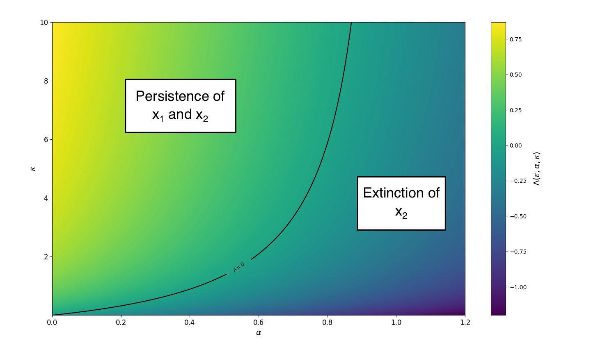

# gamma-distribution-heatmap

Heatmap and contour of Lambda(eps, alpha, kappa) = E[ X / (1 + X) ] – alpha, where X ~ Gamma(k, theta).  
Numerical integration via Gauss–Laguerre quadrature (in log-space) plus analytic continuation; high-precision special functions handled with `mpmath`.

---

## Lambda(eps, alpha, kappa) — heatmap & contour with Gauss–Laguerre quadrature

This repository computes and visualizes

    Lambda(eps, alpha, kappa) = E[ X / (1 + X) ] - alpha
    where X ~ Gamma(k, theta)

on a 2D grid for a fixed eps > 0, while:
- alpha varies on the x-axis
- kappa varies on the y-axis

It uses **Gauss–Laguerre quadrature in log-space** for numerical stability and **analytic continuation** when `eps**2 >= 2`. High-precision special functions are handled with `mpmath`.

  <em>Example output (heatmap with the Lambda = 0 contour for eps = 0.6)</em> 
  

---

## Mathematical outline

Let

- `k = 2 / eps**2 - 1`
- `theta = (eps**2 * kappa) / 2`

Then

    E[ 1 / (1 + X) ]
      = (1 / Gamma(k)) * ∫_0^∞ y^(k-1) * exp(-y) / (1 + theta * y) dy

after the change of variables `x = theta * y`.

We evaluate this integral by **Gauss–Laguerre quadrature** and then reconstruct

    E[ X / (1 + X) ] = 1 - E[ 1 / (1 + X) ]

For the regime `eps**2 >= 2`, we switch to the analytic form

    E[ 1 / (1 + X) ] = beta**k * exp(beta) * Gamma(1 - k, beta)
    with beta = 1 / theta

which is implemented with `mpmath` (regularized upper incomplete gamma) in log-space to avoid numerical overflow.

---

## Key features

- **Stable log-space accumulation** (`logsumexp`) for Gauss–Laguerre nodes and weights
- **High precision** special functions (`mpmath`, configurable `mp.mp.dps`)
- **Automatic regime selection**: quadrature for `eps**2 < 2`.
- **Fast precomputation in kappa**: Lambda = E[X / (1 + X)] – alpha is precomputed over kappa and broadcast over alpha
